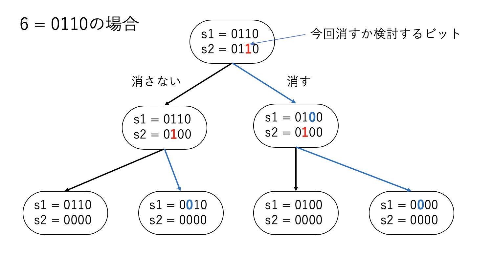

# 与えられたビット列のビットの組み合わせをすべて列挙

## はじめに

あるビット列が与えられた時、その全てのビットについて「立っているか、立っていないか」の状態の組み合わせを列挙したい。

例えば`00100110`が入力された時、3ビット立っているので、それぞれが立っているか、立っていないかで2**3=8通りのビット列、つまり

```sh
00100110
00000110
00100010
00000010
00100100
00000100
00100000
00000000
```

が出力されて欲しい。ビット演算書いてて、同じようなコードを「あれ？これどうやって書くんだっけ？」と毎回考えてる気がしたので覚書として残しておく。

## 実装例

C++で書くならこんな感じになる。

```c++
template <class T> void search(T s1, T s2) {
  if (s2 == 0) {
    show(s1);//これが列挙したいビット列
    return;
  }
  T lsb = (s2 & -s2);
  s2 ^= lsb;
  search(s1, s2);
  T s3 = s1 ^ lsb;
  search(s3, s2);
}
```

これに、`s1`と`s2`に同じ初期値を与えて呼んでやればよい。ソースコード全体はこんな感じ。

```cpp:test.cpp
#include <cstdint>
#include <iostream>

template <class T> void show(T v) {
  size_t size = sizeof(T) * 8;
  for (size_t i = 0; i < size; i++) {
    std::cout << ((v & (1 << (size - i - 1))) ? 1 : 0);
  }
  std::cout << std::endl;
}

template <class T> void search(T s1, T s2) {
  if (s2 == 0) {
    show(s1);
    return;
  }
  T lsb = (s2 & -s2);
  s2 ^= lsb;
  search(s1, s2);
  T s3 = s1 ^ lsb;
  search(s3, s2);
}

int main() {
  uint8_t s = 38;
  search(s, s);
}
```

実行例。

```sh
$ g++ test.cpp
$ ./a.out
00100110
00000110
00100010
00000010
00100100
00000100
00100000
00000000
```

## 動作原理

`search`に渡される二つのビット列のうち、`s1`は出力したいビット列の途中経過、`s2`は「まだチェックしていないビットの集合」を表している。

`search`は、まず渡されたビット列のうち、今回消すか残すか検討するビット位置を

```c++
T lsb = (s2 & -s2);
```

で得る。`(s2 & -s2)`は、`s2`のLSBを得る有名なビット演算。`s2`からこのビットを消しておく。

```c++
s2 ^= lsb;
```

そして、このビットを「消す場合」と「消さない場合」の二通りで分岐する。

```c++
search(s1, s2); //このビットを消さない場合
T s3 = s1 ^ lsb;
search(s3, s2); //このビットを消す場合
```

こうして再帰していき、`s2`が0になったら、「すべての立っているビットについて検討を終えた」ということなので、その時の`s1`を出力すれば良い。

例えば`s=6`の場合はこんな感じになる。



要するに、検討するビットすべてをスキャンし、それぞれについて「消す」か「消さないか」の二通りで分岐していく形になっている。

## まとめ

任意のビット列について、それぞれのビットのすべての組み合わせを列挙するコードを紹介した[^1]。

[^1]: これ、だいぶ前に誰かに教わったのだが、それが誰だったか覚えていない。おそらくherumiさんだと思われるが確証がない。
