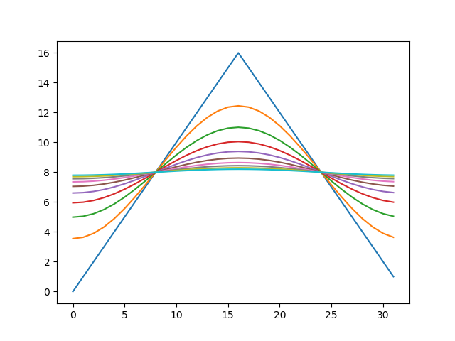
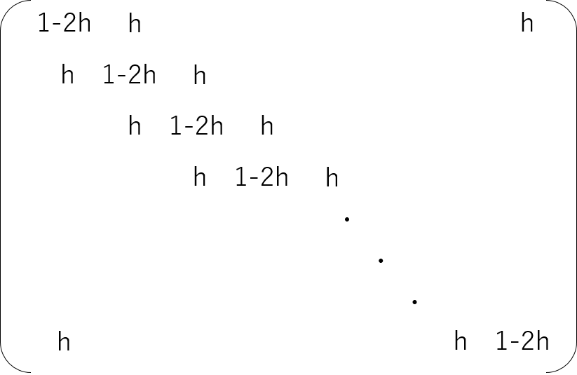

# 線形代数を学ぶ理由

# はじめに

2019年4月現在、「AI人材」という言葉がニュースを賑わせています。「現在流行っているディープラーニングその他を使いこなせる人材」くらいの意味だと思いますが、こういうバズワードの例の漏れず、人によって意味が異なるようです。併せて「AI人材のために線形代数の教育をどうするか」ということも話題になっています。

線形代数という学問は、本来は極めて広く、かつ強力な分野ですが、とりあえずは「行列とベクトルの性質を調べる学問」と思っておけば良いです。理工系の大学生は基礎解析とともに線形代数を学ぶと思います。そして、何に使うのかわからないまま「固有値」や「行列式」などの概念が出てきて、例えば試験で3行3列の行列の固有値、固有ベクトルを求め、4行4列の行列の行列式を求めたりしてイヤになって、そのまま身につかずに卒業してしまい、後で必要になって後悔する人が出てきたりします(例えば私)。

線形代数は重要な学問ですから、それを学ぶこと、強化すること自体は喜ぶべきことです。しかし、若い人がニュースなどを見て「線形代数はAIに必要だから重要」とか思ってしまうのは困ります。それでは「僕はAIをやらつもりないから線形代数いらない」という人が出てきてしまいます。

言うまでもありませんが、線形代数はAIに必要だから重要なのではありません。そもそも重要とか必要とかいうレベルではなく、誤解を恐れずにいえば「理工系の学問のほぼ全ての領域にわたってほぼ必須の学問」と言ってよい学問です。前述の通り、線形代数が関わる分野は膨大で、その全てをサーベイすることは私には不可能です。とりあえず本稿では、主に数値計算において「なぜ線形代数が重要であるか」を紹介したいと思います。

本稿は、大学の一年生ないし二年生で、線形代数を学んでいる or 学んだけど、何に使うかわからないので学ぶモチベーションが維持できない、という学生さんを対象に書いています。以下、かなりいい加減な書き方をするので、「線形代数が重要なのは当然だろ」と思っている人とか、数学ガチ勢な皆さんはブラウザの「戻る」ボタンを押してください。

# 用語の整理

まず、ざっと線形代数の用語の定義をしておきましょう。

以下のような2行2列の行列を考えます。

$$
A =
\begin{pmatrix}
5/4 & 3/4\\
3/4 & 5/4
\end{pmatrix}
$$

さて、

$$
A v = \lambda v
$$

のように、ある行列$A$にベクトル$v$をかけた結果$A v$が、入力ベクトルの定数倍$\lambda v$になった時、$v$を$A$の**固有ベクトル**、$\lambda$を**固有値**と呼ぶのでした。

先程の行列の固有ベクトルはそれぞれこんな感じになります。

$$
v_1 =
\frac{1}{\sqrt{2}}
\begin{pmatrix}
1 \\
1
\end{pmatrix}
$$

$$
v_2 =
\frac{1}{\sqrt{2}}
\begin{pmatrix}
1 \\
-1
\end{pmatrix}
$$

固有値はそれぞれ2と1/2です。

$$
\begin{aligned}
A v_1 &= 2 v_1 \\
A v_2 &= \frac{1}{2} v_2
\end{aligned}
$$

二つのベクトル$x,y$から一つのスカラー値を作る写像$(x,y)$を**内積**と呼びます。内積は、「あるベクトル$x$からあるベクトル$y$へ射影したときの長さ」、すなわち「あるベクトル$x$に、あるベクトル$y$の成分がどれくらい含まれるか」を表現するものです。内積が0の場合は、「このベクトル$x$はベクトル$y$の成分を全く含まない」ことを意味します。これを**直交している**といいます。先程の二つの固有ベクトルはお互いに直交しています。直交しているからには平行ではありえません。お互いに平行ではないベクトルは**線形独立である**といいます(直交性は必ずしも線形独立性の条件ではありません)。空間次元と同じ数だけ線形独立なベクトルの集合を持ってくれば、空間の任意のベクトルをそのベクトルの線形和で表現できるのでした。このようなベクトルを空間の**基底**と呼びます。

基底が、「自分自身との内積は1、それ以外の基底との内積が0」を満たす場合、その基底の集合を**正規直交基底**と呼びます。

基底の線形和で任意のベクトルを表現できるのでした。例えば、あるベクトル$a$を先程の基底で表現してみましょう。

$$
a = c_1 v_1 + c_2 v_2
$$

基底$v_1, v_2$が正規直交基底である場合、両辺$v_1$や$v_2$との内積を取るだけで、係数$c_1$や$c_2$が求まるのでした。

$$
\begin{aligned}
(v_1,a) &= c_1 (v_1,v_1) + c_2 (v_1 , v_2)\\
&= c_1
\end{aligned}
$$

ここで、$(v_1 , v_1 )= 1$、$(v_1 , v_2) = 0$を使っています。

この行列や固有値の意味を考えてみましょう。この行列$A$は、$v_1$の方向に2倍に引き伸ばし、$v_2$の方向に半分に縮めるような変換になっています。


この図を見ると、「時計回りに45度傾けたような座標で考えた方が楽そうだな」と気づくと思います。従って、例えば何kのベクトルに$A$を何度もかける必要がある場合、一度世界を回して固有ベクトルの張る空間にして、そのあと演算してから、また元に戻した方が計算が楽です。

また、「ある方向に2倍に引き伸ばし、その方向と直交する方向に半分に縮める」という変換であることから、$A$をかけるという変換が図形の形を変えても、面積は変えないだろう、という予想もつくかと思います。$A$という行列により図形の面積がどう変化するかは、行列式$|A|$からわかります。実際に計算してみると、$A$の行列式は1になります。

$$
|A| = \frac{5}{4} \times \frac{5}{4}
- \frac{3}{4} \times \frac{3}{4} = 1
$$

# フーリエ・ラプラス解析

物理とは世の中を記述する学問ですが、世の中は「支配方程式」と呼ばれる微分方程式で記述されています。したがって、何か世の中を記述、理解したいと思えば、微分方程式を解く必要が出てきます。しかし、微分方程式は、一般に線形でなければ解くことができません。この線形(偏)微分方程式をフーリエ変換、もしくはラプラス変換で解けるようになる、というのが理工系の大学における数学の一つのハイライトとなります。「微分・積分」は「解析学」に属す概念でありながら、フーリエ変換やラプラス変換は線形代数における基底の変換になっている、と理解することがポイントです。

先程、二つのベクトルからスカラーを作る写像として内積を定義しました。同様に二つの関数$f, g$の間にも、以下のようにして内積が定義できます。

$$
(f,g) \equiv \int_{-\infty}^{\infty}  f^* g dx
$$

ここで$f^*$は$f$の複素共役ですが、とりあえずは気にしなくて大丈夫です。フーリエ変換では、$\exp{(ikx)}$という「基底」で関数を展開するのでした。ある関数$f(x)$のフーリエ変換$\hat{f}(k)$を求めるのに、関数$f$と$\exp{(ikx)}$との内積、

$$
\begin{aligned}
\hat{f}(k) &= (f, \exp{(ikx)}) \\
&= \int_{-\infty}^{\infty}  f^* g dx
\end{aligned}
$$

を計算しているのを思い出しましょう。これは、$f(x)$という関数を様々な波数$k$を持つ基底関数で展開した時の、ある特定の$k$を持つ基底関数$\exp{(ikx)}$の係数を計算したことになります。つまりこれは、ある空間から$\exp{(ikx)}$という形の基底関数が張る空間への変換になっています。

ではなぜ$\exp{(ikx)}$という基底で展開するのでしょうか。それは**指数関数が微分演算子の固有関数だから**です。$\exp{(ikx)}$を$x$で微分しても$ik$が出てくるだけで、またもとの関数に戻ります。微分演算子を$A$、関数$\exp{(ikx)}$を$v_{ik}$と表現すると、

$$
A v_{ik} = ik v_{ik}
$$

となり、先程の2行2列の行列の場合と全く同様に扱えることがわかるでしょう。ラプラス変換も同様です。

このように、線形(偏)微分方程式がフーリエ・ラプラス変換で簡単に解けるのは、「指数関数が微分演算子の固有関数である」「固有関数で展開してしまえば計算が楽になる」という事実を利用しています。さらにいえば、これが「平面波展開」になっていることを授業で学ぶはずです。

ここで、演算子がもっとややこしい形をしていても、固有関数で展開してしまえば計算が楽になるだろう、と予想がつくでしょう。極座標の計算はかなり面倒ですが、球面調和関数を使えば計算が楽になります。これは球面調和関数が極座標のラプラシアンの固有関数になっているからです。エルミート多項式やルジャンドル多項式もまったく同様に理解できます。

# 数値計算

線形代数は様々な分野に顔を出しますが、数値計算でも極めて重要な役割を果たします。既に述べたように、この世界は微分方程式で記述されており、ほとんどの場合において厳密に解くことができません。そこで、数値的に近似解を求めることになりますが、その際に方程式を離散化することで数値的に扱えるようにします。すると、微分方程式という連続な世界から、自然に行列やベクトルが出てきます。スパコンのランキングで有名なTop500では、非常に大きな連立一次方程式を解きます。これは、ベンチマークとしてよい性質を持っている、ということもありますが、そもそも数値計算において馬鹿でかい連立一次方程式を解くというニーズがあるからベンチマークとして選ばれているという側面もあります。以下では、微分方程式を離散化すると、線形代数が顔を出す様子を見てみましょう。

## 熱伝導方程式

まず、簡単な例として熱伝導方程式を考えましょう。一次元ならこんな方程式です。

$$
\frac{\partial T}{\partial t} = \frac{\partial^2 T}{\partial x^2}
$$

ここで、$T(x;t)$は、時刻$t$における位置$x$の温度です。周期境界条件をとるので、輪になっている針金の温度を表現していると思ってください。簡単のため、熱伝導率を1としています。さて、この方程式はフーリエ変換で厳密に解けますが、差分化して数値的に解くことにします。空間方向は刻み幅1で、時間方向は時間刻み$h$で離散化しましょう。$t=0$を$0$ステップ目とすると、$n$ステップ目、$i$番目の位置の温度を$v_n^i$で表現します。先ほどの微分方程式を、空間方向は中央差分、時間方向は一次のオイラー法で差分化すると、

$$
v^i_{n+1} = v^i_n + h (v_n^{i-1} - 2 v_n^i + v_n^{i+1})
$$

と書き換えられます。初期条件として$v_i^0$が与えられれば、上記の式に従って$v_i^1, v_i^2, \cdots ,v_i^n$と、任意の時刻、場所の温度が求められることになります。これを素直にコードに実装してみましょう。空間を$N$分割し、周期境界条件を課して、初期条件として山型の温度分布を与えます。適当な時間刻みで時間発展させ、途中の温度を重ねてプロットするPythonコードはこんな感じになるでしょう[^1]。

[^1]:シンプルに書くために非効率的に書いています。

```py
import copy
import matplotlib
import matplotlib.pyplot as plt
import numpy as np

def calc(v, h):
    v2 = copy.copy(v)
    N = len(v)
    for i in range(N):
        i1 = (i+1) % N
        i2 = (i - 1 + N) % N
        v[i] = v2[i] + (v2[i1] - 2.0*v2[i] + v2[i2])*h

N = 32
v = np.array([min(x, N-x) for x in range(N)], dtype='float64')

h = 0.1
r = []
for i in range(1000):
    calc(v, h)
    if (i % 100) == 0:
        r.append(copy.copy(v))

for s in r:
    plt.plot(s)
```

上記をJupyter NotebookかGoogle Colabで実行すれば、以下のような出力が得られます。



初期条件として山型の温度分布を与えたのが、だんだんとなまっていき、最終的に直線、すなわち一様な温度分布になったことがわかります。

さて、先ほどの離散化した式ですが、以下のような行列とベクトルの積の成分を表示したものと思うことができます。

$$
\vec{v}_{n+1} = A \vec{v}_n
$$

ただし、$A$は以下のような形をした$N$行$N$列の行列です。



対角成分が$1-2h$、その両隣が$h$となる三重対角行列になっていますが、周期境界条件の影響で、上端と下端だけ$h$の場所がずれています。

もともと時間発展は微分方程式で記述されていましたが、離散化により状態がベクトルで表現され、そのベクトルに行列をかけると次のステップの状態が得られる、という行列とベクトルの問題に帰着されました。離散化により自然に線形代数が出てきたのがわかるかと思います。

この、「現在の温度分布を表すベクトルに行列をかけると次のステップの温度分布が出てくる」という計算を素直にコードに落とすとこんな感じになるでしょう。

```py
import copy

import matplotlib
import matplotlib.pyplot as plt
from scipy import linalg
import numpy as np

N = 32
h = 0.1
v = np.array([min(x, N-x) for x in range(N)], dtype='float64')
A = np.zeros((N, N))

# 行列Aを作る
for i in range(N):
    i1 = (i + 1) % N
    i2 = (i - 1 + N) % N
    A[i][i] = 1.0 - 2.0*h
    A[i][i1] = h
    A[i][i2] = h

r = []
for i in range(1000):
    v = A.dot(v) # Aをかけると次のステップの状態が得られる
    if (i % 100) == 0:
        r.append(copy.copy(v))

for s in r:
    plt.plot(s)
```

実行すると先ほどと同じ結果が得られます。

## 固有値問題

# まとめ

しつこいですが線形代数は広範な範囲にまたがって活躍する重要な学問です。ここで紹介した用語の他にも「行列のランク」「対角和(トレース)」「正則性」など、初学者にとっては「計算方法や定義はわかったけど、なんの役に立つのさ？」という用語が多数出てきます。もちろん重要だからそういう用語が定義されるのですが、それら全ての例を挙げる前に執筆者が力尽きました。詳細は適当にググるか、教科書を参照するか、他の人が記事を書くのを待ってください。
