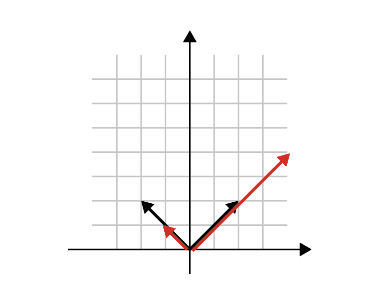

# 線形代数を学ぶ理由

# はじめに

2019年4月現在、「AI人材」という言葉がニュースを賑わせています。「現在流行っているディープラーニングその他を使いこなせる人材」くらいの意味だと思いますが、こういうバズワードの例の漏れず、人によって意味が異なるようです。併せて「AI人材のために線形代数の教育をどうするか」ということも話題になっています。

線形代数という学問は、本来は極めて広く、かつ強力な分野ですが、とりあえずは「行列とベクトルの性質を調べる学問」と思っておけば良いです。理工系の大学生は基礎解析とともに線形代数を学ぶと思います。そして、何に使うのかわからないまま「固有値」や「行列式」などの概念が出てきて、例えば試験で3行3列の行列の固有値、固有ベクトルを求め、4行4列の行列の行列式を求めたりしてイヤになって、そのまま身につかずに卒業してしまい、後で必要になって後悔する人が出てきたりします(例えば私)。

線形代数は重要な学問ですから、それを学ぶこと、強化すること自体は喜ぶべきことです。しかし、若い人がニュースなどを見て「線形代数はAIに必要だから重要」とか思ってしまうのは困ります。それでは「僕はAIをやらつもりないから線形代数いらない」という人が出てきてしまいます。

言うまでもありませんが、線形代数はAIに必要だから重要なのではありません。そもそも重要とか必要とかいうレベルではなく、誤解を恐れずにいえば「理工系の学問のほぼ全ての領域にわたってほぼ必須の学問」と言ってよい学問です。前述の通り、線形代数が関わる分野は膨大で、その全てをサーベイすることは私には不可能です。とりあえず本稿では、主に数値計算において「なぜ線形代数が重要であるか」を紹介したいと思います。

# 用語の整理

まず、ざっと線形代数の用語の定義をしておきましょう。以下、かなりいい加減な定義をするので、真面目な人とか数学ガチ勢はブラウザの「戻る」ボタンを押してください。

以下のような2行2列の行列を考えます。

$$
A =
\begin{pmatrix}
5/4 & 3/4\\
3/4 & 5/4
\end{pmatrix}
$$

さて、

$$
A v = \lambda v
$$

のように、ある行列$A$にベクトル$v$をかけた結果$A v$が、入力ベクトルの定数倍$\lambda v$になった時、$v$を$A$の**固有ベクトル**、$\lambda$を**固有値**と呼ぶのでした。

先程の行列の固有ベクトルはそれぞれこんな感じになります。

$$
v_1 =
\frac{1}{\sqrt{2}}
\begin{pmatrix}
1 \\
1
\end{pmatrix}
$$

$$
v_2 =
\frac{1}{\sqrt{2}}
\begin{pmatrix}
1 \\
-1
\end{pmatrix}
$$

固有値はそれぞれ2と1/2です。

$$
\begin{aligned}
A v_1 &= 2 v_1 \\
A v_2 &= \frac{1}{2} v_2
\end{aligned}
$$

二つのベクトル$x,y$から一つのスカラー値を作る写像$(x,y)$を**内積**と呼びます。内積は、「あるベクトル$x$からあるベクトル$y$へ射影したときの長さ」、すなわち「あるベクトル$x$に、あるベクトル$y$の成分がどれくらい含まれるか」を表現するものです。内積が0の場合は、「このベクトル$x$はベクトル$y$の成分を全く含まない」ことを意味します。これを**直交している**といいます。先程の二つの固有ベクトルはお互いに直交しています。直交しているからには平行ではありえません。お互いに平行ではないベクトルは**線形独立である**といいます(直交性は必ずしも線形独立性の条件ではありません)。空間次元と同じ数だけ線形独立なベクトルの集合を持ってくれば、空間の任意のベクトルをそのベクトルの線形和で表現できるのでした。このようなベクトルを空間の**基底**と呼びます。

基底が、「自分自身との内積は1、それ以外の基底との内積が0」を満たす場合、その基底の集合を**正規直交基底**と呼びます。

基底の線形和で任意のベクトルを表現できるのでした。例えば、あるベクトル$a$を先程の基底で表現してみましょう。

$$
a = c_1 v_1 + c_2 v_2
$$

基底$v_1, v_2$が正規直交基底である場合、両辺$v_1$や$v_2$との内積を取るだけで、係数$c_1$や$c_2$が求まるのでした。

$$
\begin{aligned}
(v_1,a) &= c_1 (v_1,v_1) + c_2 (v_1 , v_2)\\
&= c_1
\end{aligned}
$$

ここで、$(v_1 , v_1 )= 1$、$(v_1 , v_2) = 0$を使っています。

この行列や固有値の意味を考えてみましょう。この行列$A$は、$v_1$の方向に2倍に引き伸ばし、$v_2$の方向に半分に縮めるような変換になっています。

この図を見ると、「時計回りに45度傾けたような座標で考えた方が楽そうだな」と気づくと思います。また、「ある方向に2倍に引き伸ばし、その方向と直交する方向に半分に縮める」という変換であることから、$A$をかけるという変換が図形の形を変えても、面積は変えないだろう、という予想もつくかと思います。$A$という行列により図形の面積がどう変化するかは、行列式$|A|$からわかります。実際に計算してみると、$A$の行列式は1になります。

$$
|A| = \frac{5}{4} \times \frac{5}{4}
- \frac{3}{4} \times \frac{3}{4} = 1
$$

## フーリエ・ラプラス解析

物理とは世の中を記述する学問ですが、世の中は「支配方程式」と呼ばれる微分方程式で記述されています。したがって、何か世の中を記述、理解したいと思えば、微分方程式を解く必要が出てきます。しかし、微分方程式は、一般に線形でなければ解くことができません。この線形(偏)微分方程式をフーリエ変換、もしくはラプラス変換で解けるようになる、というのが理工系の大学における数学の一つのハイライトとなります。ここで、「微分・積分」は「解析学」に属す概念でありながら、フーリエ変換やラプラス変換は線形代数における基底の変換になっています。

先程、二つのベクトルからスカラーを作る写像として内積を定義しました。同様に二つの関数$f, g$の間にも、以下のようにして内積が定義できます。

$$
(f,g) \equiv \int_{-\infty}^{\infty}  f^* g dx
$$

フーリエ変換では、$\exp{(ikx)}$という「基底」で関数を展開するのでした。ある関数$f(x)$のフーリエ変換$\hat{f}(k)$を求めるのに、関数$f$と$\exp{(ikx)}$との内積、

$$
\begin{aligned}
\hat{f}(k) &= (f, \exp{(ikx)}) \\
&= \int_{-\infty}^{\infty}  f^* g dx
\end{aligned}
$$

を計算しているのを思い出しましょう。これは、$f(x)$という関数を様々な波数$k$を持つ基底関数で展開した時の、ある特定の$k$を持つ基底関数$\exp{(ikx)}$の係数を計算したことになります。つまりこれは、ある空間から$\exp{(ikx)}$という形の基底関数が張る空間への変換になっています。

ではなぜ$\exp{(ikx)}$という基底で展開するのでしょうか。それは**指数関数が微分演算子の固有関数だから**です。$\exp{(ikx)}$を$x$で微分しても$ik$が出てくるだけで、またもとの関数に戻ります。微分演算子を$A$、関数$\exp{(ikx)}$を$v_{ik}$と表現すると、

$$
A v_{ik} = ik v_{ik}
$$

となり、先程の2行2列の行列の場合と全く同様に扱えることがわかるでしょう。ラプラス変換も同様です。

このように、線形(偏)微分方程式がフーリエ・ラプラス変換で簡単に解けるのは、「指数関数が微分演算子の固有関数である」「固有関数で展開してしまえば計算が楽になる」という事実を利用しています。さらにいえば、これが「平面波展開」になっていることを授業で学ぶはずです。

ここで、演算子がもっとややこしい形をしていても、固有関数で展開してしまえば計算が楽になるだろう、と予想がつくでしょう。極座標の計算はかなり面倒ですが、球面調和関数を使えば計算が楽になります。これは球面調和関数が極座標のラプラシアンの固有関数になっているからです。エルミート多項式やルジャンドル多項式もまったく同様に理解できます。

# 固有値問題

# 線形安定性解析

# まとめ

しつこいですが線形代数は広範な範囲にまたがって活躍する重要な学問です。ここで紹介した用語の他にも「行列のランク」「対角和(トレース)」「正則性」など、初学者にとっては「計算方法や定義はわかったけど、なんの役に立つのさ？」という用語が多数出てきます。もちろん重要だからそういう用語が定義されるのですが、それら全ての例を挙げる前に執筆者が力尽きました。詳細は適当にググるか、教科書を参照するか、他の人が記事を書くのを待ってください。
