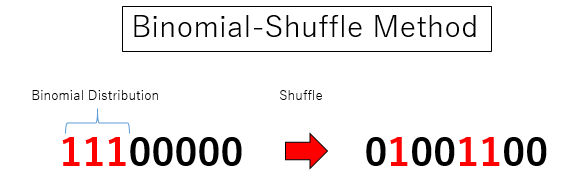
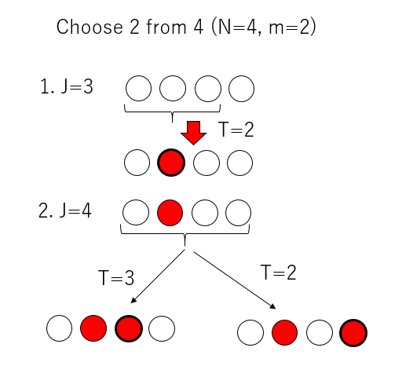
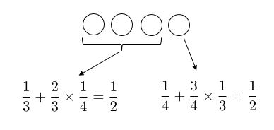
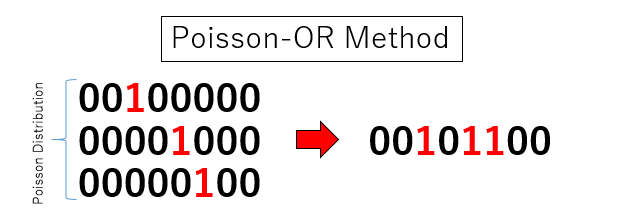
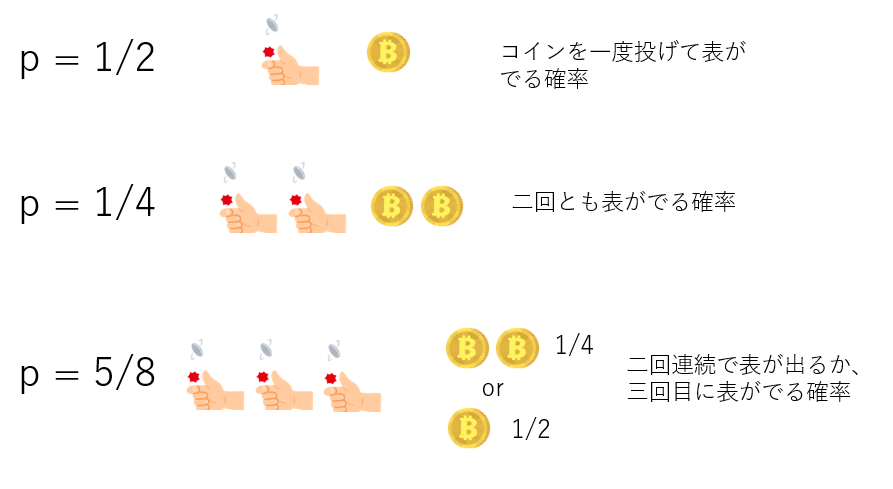
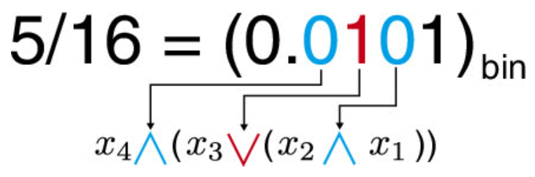
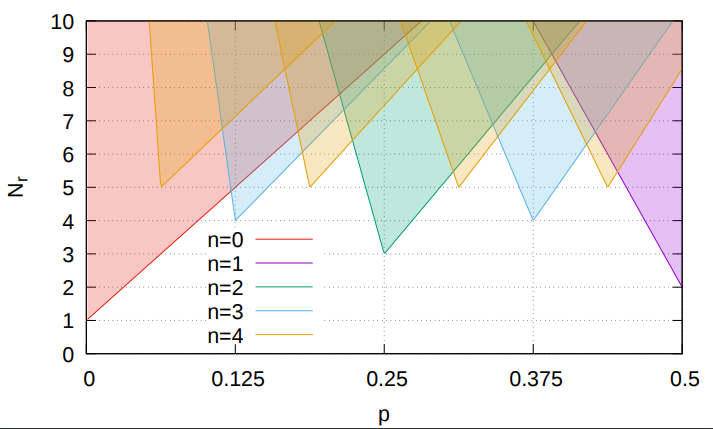

# 任意の確率で独立にビットが立っているビット列を高速に生成する方法

## はじめに

「それぞれのビットが、確率$p$で1となっているようなランダムなビット列」が欲しくなる時ってありませんか？例えばスピン系とかのマルチスピンコーディングとかする時に必要だったりします。マルチスピンコーディングというのは、スピンの自由度をビットとしてパックして、同時に複数のスピンの状態を更新する手法で、ビット演算の並列性を使って計算を加速します。

さて、「指定の確率でビットが立っているランダムなビット列」はどうやって作ればよいでしょうか。もっともナイーブには、ビットの数だけ乱数を使えばそんなビット列を作ることができます。32ビットならこんな感じでしょうか。

```cpp
uint32_t rbs(double p, std::mt19937 &mt){
  std::uniform_real_distribution<> ud(0.0,1.0);
  uint32_t v;
  for(int i=0;i<32;i++){
    if (ud(mt) < p){
      v |= (1 << i);
    }
  }
  return v;
}
```

さて、このシンプルなアルゴリズムだと、ビット長だけ(つまり32ビットなら32回)乱数を呼び出す必要があります。そもそもビット演算の並列性を使って計算を加速したいのに、ビット長の回数だけ乱数を呼び出していては計算が遅くて仕方ありません。というわけで、少ない乱数生成でこのようなランダムなビット列を作る方法を紹介します。以下、ビット長を$N$とします。

## 二項分布＋シャッフル法(Binomial-Shuffle Algorithm)

シンプルな方法を見て思うのは、確率$p$が小さいときに無駄が多い、ということです。$p$が小さい時はビットがほとんど立たないのに、毎回$N$回も乱数を振るのは無駄な気がします。そこで、まずあらかじめ「何個のビットが立つか」を決め、次に「そのビットはどこに立つべきか」を決めることにしましょう。$N$ビットのそれぞれが確率$p$で1になるとき、立つビットの数$m$はパラメタ$(N,p)$の二項分布に従います。まず二項分布で立つビット数を決め、次のそのビットをシャッフルする形になるので、二項分布＋シャッフル法(Binomial-Shuffle Algorithm)と呼ぶことにします。



C++には指定のパラメタの二項分布に従うような乱数を生成するライブラリもありますが、$N$と$p$が決まっているなら、あらかじめテーブルを作ってWalker's Alias法を使うことで、一度の乱数生成で$m$を決めることができます。Walker's alias法は、有限個の要素が、それぞれ指定の重みをもっているとき、重みに比例して要素をランダムに選ぶアルゴリズムです。計算量は$O(1)$ですが、「箱を選ぶ」のと、「箱の中の二択」にそれぞれ一回ずつ、二回の乱数生成を伴います。詳しくは[以前書いた記事](https://qiita.com/kaityo256/items/1656597198cbfeb7328c)を参照してください。今回のケースでは、一つの乱数の下位ビットを箱の選択に、上位ビットを箱の中の二択に使うことで、一度の乱数生成で二項分布に従う確率変数を生成できます。

さて、いま$N$ビットのうち、$m$ビット立てることを決めました。次に、そのビットの位置を決めなくてはなりません。このような場合、Floydのサンプリング法が有効に使えます。僕はFloydのサンプリング法の原著論文や書籍を知らないのですが、とりあえず[ここ](http://www.nowherenearithaca.com/2013/05/robert-floyds-tiny-and-beautiful.html
)で知りました。GCCだったかLLVMだったか忘れましたが、`std::shuffle`がこれ使ってた記憶があります。

Floydのサンプリング法は、疑似コードで書くとこんな感じです。

```basic
initialize set S to empty
    for J := N-m + 1 to N do
      T := RandInt(1, J)
      if T is not in S then
        insert T in S
      else
        insert J in S
```

言葉で書くと、

1. J個のなかから一つランダムに(一様に)選べ
2. もしそれが選ばれたことがなければそれを選べ
3. もしそれが選ばれていたのならJ番目を選べ
4. 以上の処理をJがN-m+1からNまで増やしながら繰り返せ

というものです。たとえば、$N=4$、$m=2$の場合を考えましょう。



1. 最初は$J=N-m+1=3$なので、1から3個目のなかから一つ選びます。
2. 次は$J=4$なので、すべての要素から一つ選びます。この時、もし最初に選んだものを選択してしまったら、4番目のものを選びます。



この時、最初の3つが選ばれる確率は、「最初に選ばれるか、二番目のステップで選ばれるか」の二通りで、合わせて1/4。4つ目が選ばれるのは二番目のステップだけですが、そこで「既に選ばれた奴が選ばれるか、4番目が選ばれるか」の二通りで、やはり1/4となり、結果として一様に選ばれていることがわかります。一般の$N$や$m$の場合には数学的帰納法で証明できます。

Floydのサンプリング法は、$n$個の要素を選ぶのに$n$回の乱数生成で済みます。$N$ビットのビット列について、確率$p$でビットを立てると平均的には$pN$ビット立ちますから、二項分布+シャッフル法は二項分布の分も合わせて$pN+1$の乱数生成で済みます。

## ポアソン分布+論理和法(Poisson-OR algorithm)

二項分布＋シャッフル法は、最初に立つビットの数を決め、次に場所を決める方法でした。これとはちょっと違うアプローチをとってみましょう。

$N$ビットのうち、ランダムに一つだけビットが立っているようなビット列を$k$個生成し、その論理和(OR)を取ります。この時、$k$をポアソン分布で生成すると、出来上がるビット列は、ある確率で独立に1となります。ポアソン分布のパラメタ$\lambda$をうまく調整することで、所望の確率$p$でビットをランダムに立てることができます。ポアソン分布と論理和を組み合わせる方法なので、ポアソン分布＋論理和法(Poisson-OR algorithm)と呼びましょう。



さて、ポアソン分布のパラメタ$\lambda$と確率$p$の関係を見てみましょう。各ビットは$1/N$の確率で$1$です。それを$k$個ORしても0である確率は$(1 - 1/N)^k$です。パラメタ$\lambda$のポアソン分布に従う確率変数が$k$という値をとる確率は$\lambda^k \mathrm{e}^{-\lambda}/k!$です。それらの総和をとると、ビットが立たない確率、すなわち$1-p$になるので、

$$
1-p = \sum_{k=0}^\infty (1 - 1/N)^k \lambda^k \mathrm{e}^{-\lambda}/k!
$$

これを$\lambda$について解くと、

$$
\lambda = -N\log(1-p)
$$

となります。このパラメタのポアソン分布に従う確率変数$k$を決め、1ビットだけランダムに立っているビット列を$k$個生成し、その全ての論理和をとると、確率$p$で各ビットが独立に1となるようなビット列を得ることができます。このアルゴリズムは、Todo-Suwaのアルゴリズム[2]の特殊な場合になっています。このような操作で、なぜ各ビットが独立に確率$p$で1となるかの証明は面白いので、そのうち別記事で紹介します。

二項分布+シャッフル法と同様に、Walker's alias法を使うことで、ポアソン分布に従う確率変数の生成は乱数を一回振るだけでできます。また、作らなければならない「一つだけランダムにビットが立ったビット列」は、平均的には$\lambda = -N \log(1-p)$個です。したがって、その数だけ乱数を振る必要があります。従って、ポアソン分布＋論理和法が必要とする乱数生成の数は、合計で$-N\log(1-p) +1$回です。$0<p<1$の場合、不等式$p < -\log(1-p)$が成り立ちますから、ポアソン分布＋論理和法は、二項分布＋シャッフル法よりも乱数生成回数が多くなります。しかし、最内ループに条件分岐が入らなくなるため、その分計算が早くなる可能性があります。

## 有限桁法 (Finit-digit algorithm)

二項分布＋シャッフル法、ポアソン分布＋論理和法ともに、$p$が小さいときには有効ですが、$p$が大きくなると乱数生成回数が増えてしまいます。そこで、さらに違うアプローチを考えましょう。

今、手元にコインが1枚だけあるとします。これで「確率1/2を作ってくれ」と言われたら、単に「コイン一度弾いて表が出る確率」とすればよいでしょう。「確率1/4を作ってくれ」と言われたら、「コインを二度弾いて、二回とも表がでる確率」と言えばよいです。「確率5/8を作ってくれ」と言われたら？少し頭を使いますが「コインが二度連続で表が出るか、もしくは三回目に投げたコインで表がでる確率」と言えばよいです。



これを応用すると、「二進表記で$n$桁となる確率$p$で1となるビットは、確率1/2で1であるようなビットを$n$個ビット演算することで得られる」ことがわかります。具体的に、$p=5/16$で1となるビットを作りたいとします。まず$p=5/16$を二進数表記すると$p=0.0101$となります。これは4桁なので、ビットを4つ用意します。これを$x_1,x_2,x_3,x_4$としましょう。ここで、一番右のビットの左隣りのビットから見て、ビットが1ならOR、0ならANDをとることにします。最終的に

$$
y = x_4 \land (x_3 \lor (x_2 \land x_1))
$$

とすることで、$y$は確率$5/16$で1となるビット列になります。



いま、質の良い乱数、例えばメルセンヌ・ツイスタを使うと、例えば32ビットや64ビットの整数乱数が得られますが、これらのビットは独立に確率$1/2$で1となるとみなせます。したがって、確率$p$が二進数で$n$桁で表現できるときには、乱数を$n$回生成して、$n-1$回ビット演算をすれば、確率$p$でビットが1となるビット列を得ることができます。これを有限桁法(Finite-digit algorithm)と呼びましょう。確率$p$の精度があまり必要ないときには有効です。

## ハイブリッド法

確率$p$でビットが独立に1となるようなビット列が欲しいとき、$p$が小さいときには二項分布＋シャッフル法やポアソン分布＋論理和法が、$p$が低精度でよい場合には有限桁法が有効です。これらを組み合わせると、さらに有効なアルゴリズムを構築できます。

例えば、一次元directd bond percolationの臨界点である$p=0.6447$でビットが立っている32ビットのビット列を生成したいとしましょう。そのまま二項分布＋シャッフル法やポアソン分布＋論理和法を適用すると、約22回の乱数生成が必要になります($1-p$で生成してビット反転すればもっと少なくてすみますが、それはさておきます)。さて、`std::mat19937`などで乱数を一度だけ生成すると、各ビットが$p=0.5$で立っているビット列$y$が得られます。これと、別のビット列$z$と論理和をとることで確率を補正しましょう。少し計算すると、$z$は確率$p=0.29$でビットが立っているようなビット列であればよいことがわかります。そのようなビット列$z$は、二項分布シャッフル法やポアソン分布＋論理和法で10回(0.29*32+1)の乱数生成で生成できるため、$y$に必要な分を加えて11回の乱数生成で所望のビット列が生成できます。これは、確率$p$の一桁近似$\tilde{p} = 0.5$からの補正と考えることができます。

近似の制度を3桁にするとさらに効果的になります。$p=0.6447$を$\tilde{p} = 0.625$と近似し、近似したビット列$y$を作ります。補正用ビット列$z$は、確率$0.053$でビットが立っているようなビット列であればよいので、3回弱の乱数生成で作れます。これは3桁近似なので$y$を作るのに3つの乱数が必要なので、合わせて6回弱(正確には5.68回)で所望のビット列が作れます。

近似の桁数を上げるほど$z$を作るための乱数生成回数は減りますが、$y$を作るための乱数生成回数が増えるため、どこかに最適な近似桁数があります。さらに、$p$の値によって、何桁で近似するのがよいかも決まります。そんな「地図」を作るとこんな感じになります。



この図は、それぞれのビットが確率$p$で立っているような32ビットのビット列を生成するのに、平均何回の乱数生成が必要かを表しています。$n$は近似桁数です。例えば$p<0.12$くらいまでは近似しないで直接二項分布シャッフル法かポアソン分布＋論理和法を使った方が早いことがわかりますが、$p=0.125$に近い場合は、3桁近似してから補正した方が効率的です。また、最大でも4桁近似で用が足りて、5桁以上の近似は不要であることや、最大でも平均7回の乱数生成で任意の確率$p$を表現可能であることがわかります。

## 性能や応用例

性能や応用例については[論文](https://doi.org/10.7566/JPSJ.88.024004)に書いたので、そちらを参照してください(丸投げ)。たとえば$p=0.6447$でビットが1となるようなビット列を生成するのに、単純な方法に比べて32ビットで3.8倍、64ビットで6.8倍くらい加速します。また、二項分布＋シャッフル法よりもポアソン分布＋論理和法の方が高速でした。乱数生成回数が若干増えるペナルティよりも、最内ループ内に条件分岐があるペナルティの方が大きかったようです。また、このアルゴリズムを応用してDirected-Bond-Percolationのマルチスピンコーディングを実装し、14倍程度高速化できました。

ビット列生成アルゴリズムの実装例は

[https://github.com/kaityo256/rbs](https://github.com/kaityo256/rbs)

に置いておきますので参照してください。

## 参考文献

1. H. Watanabe, S. Morita, S. Todo, and N. Kawashima, [J. Phys. Soc. Jpn. 88, 024004 (2019)](https://doi.org/10.7566/JPSJ.88.024004)
2. S. Todo and H. Suwa, [J. Phys.: Conf. Ser. 473, 012013 (2013)](https://doi.org/10.1088%2F1742-6596%2F473%2F1%2F012013).
3. [https://github.com/kaityo256/rbs](https://github.com/kaityo256/rbs)