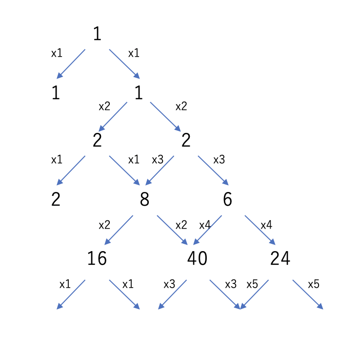

# tan(x)を何度も微分する

# はじめに

だいぶ前ですが、Twitterで「RT(Favだったかな？)の数だけtan(x)を微分する」というつぶやきを見ました。わりとRT/Favされてて収拾がつかなくなっていたようです。

$\tan(x)$は$\sin(x) / \cos(x)$なので、一度微分すると、

$$
\frac{d}{dx} \tan{x} = \frac{1}{\cos^2{x}}
$$

もう一度微分すると、

$$
\frac{d^2}{dx^2} \tan{x} = \frac{2 \sin{x}}{\cos^3{x}}
$$

と、いい感じにややこしくなっていきます。

最近、シンボリックな微分コードが欲しくなったところだったので、その練習として、tan(x)を微分するコードを書いてみましょう。

# 方針

$\tan{x}$を微分するとき、$\tan{x} = \sin{x}/\cos{x}$にして、$f(x)/g(x)$という分数の微分公式、

$$
\frac{d}{dx} \frac{f(x)}{g(x)} = \frac{f'(x) g(x) - f(x)g'(x)}{g^2(x)}
$$

を使いたくなります。しかし、プログラムで微分する場合は、

$$
\tan{x} = \cos^{-1}{x} \sin{x}
$$

という形にしたほうが扱いやすいです。

いま、$\cos{x}$と$\sin{x}$のべき乗の積、$\cos^m{x} \sin^n{x}$を考えましょう。これを微分すると、

$$
\frac{d}{dx} \cos^{m}{x} \sin^{n}{x}
= -m \cos^{m-1}{(x)} \sin^{n+1}{(x)}
+ n \cos^{m+1}{(x)} \sin^{n-1}{(x)}
$$

と、やはり$\cos^m{x} \sin^n{x}$の形しかでてきません。なので、$\tan{x} = \cos^{-1}{x} \sin{x}$という形からスタートして、後は上記のルールに従って計算していけば、何度でも微分できることになります。

# コード

というわけで、そのままコードに落としてみましょう。デフォルト値があるハッシュを使えばあっという間です。$\cos^{m}{x}\sin^{n}{x}$を、`[m,n]`という配列で表し、この配列をキーとして、係数`v`をハッシュとして登録しましょう。

```rb
def diff(h)
  h2 = Hash.new(0)
  h.each do |key, v|
    m, n = key
    h2[[m-1,n+1]] += v*n
    h2[[m+1,n-1]] -= v*m
  end
  h2
end

h = Hash.new

h[[-1,1]] = 1

5.times do
  h = diff(h)
  p h
end
```

実行するとこんな感じです。

```sh
$ ruby tan.rb
{[-2, 2]=>1, [0, 0]=>1}
{[-3, 3]=>2, [-1, 1]=>2, [1, -1]=>0}
{[-4, 4]=>6, [-2, 2]=>8, [0, 0]=>2, [2, -2]=>0}
{[-5, 5]=>24, [-3, 3]=>40, [-1, 1]=>16, [1, -1]=>0, [3, -3]=>0}
{[-6, 6]=>120, [-4, 4]=>240, [-2, 2]=>136, [0, 0]=>16, [2, -2]=>0, [4, -4]=>0}
```

これを見て気が付きました。

$\cos^{m}{x}\sin^{n}{x}$を、`[m,n]`という配列で表すと、これを微分すると`[m+1, n-1]`と`[m-1, n+1]`しか出てきません。つまり、$\cos^m{x}$と$\sin^n{x}$の係数の和`m+n`は常に一定です。

最初に$\tan{x} = \cos^{-1}{x} \sin{x}$からスタートしているので、常に$m+n=0$が成立します。つまり、$\tan{x}$を何度微分しても、$\tan{x}$のべき乗の線形和で表せる、ということです。

改めて微分の式を書くとこんな感じになります。

$$
\begin{aligned}
\frac{d}{dx} \tan{x} &= \tan^2{x} + 1 \\
\frac{d^2}{dx^2} \tan{x} &= 2 \tan^3{x} + \tan{x} \\
\frac{d^3}{dx^3} \tan{x} &= 6 \tan^4{x} + 8\tan^2{x} + 2\\
\end{aligned}
$$

これを、パスカルの三角形的な形にするとこんな感じになるでしょう。



で、ここまで考えたところで、Twitterで先行研究があることを教えていただきました。

<blockquote class="twitter-tweet" data-lang="ja"><p lang="ja" dir="ltr">これ<a href="https://t.co/iAc8z5HeLW">https://t.co/iAc8z5HeLW</a><br>ですかね？</p>&mdash; Keigo Nitadori (@k_nitadori) <a href="https://twitter.com/k_nitadori/status/1142359088740745216?ref_src=twsrc%5Etfw">2019年6月22日</a></blockquote>

あるだろうなと思ってましたが、やっぱりありましたね・・・

# まとめ

Rubyで$\tan{x}$を何度も微分するコードを書いてみました。っていうか、コードを書く前に「$\tan{x}$を何度微分しても$\tan{x}$のべき乗しか出てこない」という事実に気が付かなかったのはアホすぎますね。

この、`tan(x)`を何度も微分して、その係数がどんどん増えてややこしくなっていくという奴、なんとなく[L System](https://ja.wikipedia.org/wiki/L-system)を思い出しますね。
